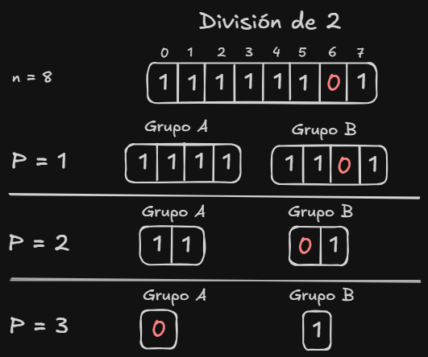
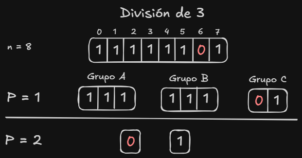
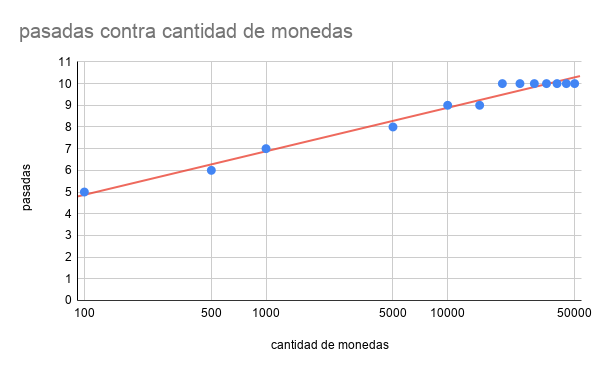
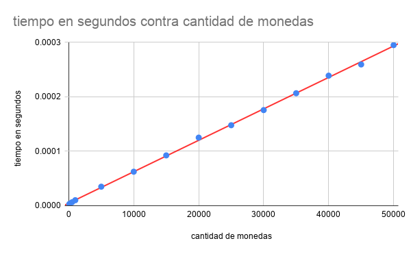

# División y Conquista

### Caso Base

El problema indica: "Se tiene una bolsa con n monedas de idéntica denominación, de las cuales exactamente una es falsa", por ende el caso base, donde solo hay una moneda, la unica moneda presente es falsa ya que el enunciado garantiza al menos una moneda falsa.

---

### Supuestos

- El peso de las moendas "no falsas" es el mismo. Para los ejemplos la moneda "falsa" es 0 y las monedas "normales" tienen valor 1.
- Se considera la pesada como una operación de tiempo constante ($O(1)$), simulando una balanza real. La implementación de Python sum(), genera un tiempo de ejecución $O(n)$ en la simulación, pero no afecta la lógica ni la cantidad de pesadas del algoritmo ($O(\log_3 n)$)

---

### Pseudocodigo

    encontrar moenda falsa(monedas, inicio, fin)
    Si inicio == fin Entonces
        devolver inicio  // Caso Base

    n <- fin - inicio + 1
    tamaño_grupo <- Techo(n / 3)

    GrupoA <- [inicio, inicio + tamaño_grupo - 1]
    GrupoB <- [inicio + tamaño_grupo, inicio + 2 * tamaño_grupo - 1]
    GrupoC <- [inicio + 2 * tamaño_grupo, fin]

    peso de a <- pesar grupo(monedas, GrupoA)
    peso de b <- pesar grupo(monedas, GrupoB)

    Si peso de a < peso de b 
        devolver encontrar moneda falsa(monedas, GrupoA)
    Sino Si peso de b < peso de a Entonces
        devolver encontrar moneda falsa(monedas, GrupoB)
    Sino
        devolver encontrar moneda falsa(monedas, GrupoC)

---

### Seguimiento de un Ejemplo

$n = 100$ y posicion de moneda falsa = 80

- Pesada 1: $n = 100$
  - División: Grupos de $\lceil 100/3 \rceil = 34$.
  - Grupos Iniciales: $A=\{0..33\}$, $B=\{34..67\}$, $C=\{68..99\}$.
  - Acción: Se pesan $A$ (34 monedas) y $B$ (34 monedas). 
  - Resultado: $Peso(A) == Peso(B)$. Ambos grupos tienen solo monedas auténticas.
  - Decisión: La falsa está en $C$ ($n=32$).
- Pesada 2: $n = 32$
  - División: Grupos de $\lceil 32/3 \rceil = 11$.
  - Grupos: $A=\{68..78\}$, $B=\{79..89\}$, $C=\{90..99\}$.
  - Acción: Se pesan $A$ (11 moendas) y $B$ (11 monedas).
  - Resultado: $Peso(B) < Peso(A)$. El grupo B tiene menos peso que el grupo A.  
  - Decisión: La falsa esta en $B$ ($n=11$).
- Pesada 3: $n = 11$
  - División: $\lceil 11/3 \rceil = 4$.
  - Grupos: $A=\{79..82\}$, $B=\{83..86\}$, $C=\{87..89\}$.
  - Acción: Se pesan $A$ (4 mondeas) y $B$ (4 monedas).
  - Resultado: $Peso(A) < Peso(B)$. El grupo A tiene menos peso que el grupo B.
  - Decisión: La falsa está en $A$ ($n=4$).
- Pesada 4: $n = 4$
  - División: $\lceil 4/3 \rceil = 2$.
  - Grupos: $A=\{79, 80\}$, $B=\{81, 82\}$, $C=\emptyset$.
  - Acción: Se pesan $A$ (2 monedas) y $B$ (2 monedas).
  - Resultado: $Peso(A) < Peso(B)$. El grupo A tiene menos peso que el grupo B.
  - Decisión: La falsa está en $A$ ($n=2$).
- Pesada 5: $n = 2$
  - División: $\lceil 2/3 \rceil = 1$.
  - Grupos: $A=\{79\}$, $B=\{80\}$, $C=\emptyset$.
  - Acción: Se pesan $A$ (1 moneda) y $B$ (1 moneda). 
  - Resultado: $Peso(B) < Peso(A)$. El grupo B tiene menos peso que le grupo A.
  - Decisión Final: Se llego al caso base ($n = 1$) por lo que la moneda en la posicion 80 es falsa.

---

### Solución Propuesta

Se propone utilizar un algoritmo de división y conquista donde el problema se particiona en 3 grupos. Al utilizar grupos de 3 para la etapa de comparación se optimiza la cantidad de iteraciónes necesarias para llegar al caso base. Esto se puede demostrar de la siguiente manera:
Si definimos $n$ como la cantidad de monedas y $P$ como la cantidad de pesadas podemos decir que la división en 2 da $P \approx \log_2(n)$ mientras que la división en 3 da $P \approx \log_3(n)$. Como $\log_3(n) < \log_2(n)$ para todo $n > 1$, la división en tres grupos nos ayuda a alcanzar el caso base en una menor cantidad de operaciones. Para ver esto vamos a utilizar un ejemplo donde $n = $ 8.

En este esquema, la cantidad de monedas "falsas" se reduce a la mitad en cada paso ($8 \to 4 \to 2 \to 1$). Como se observa en la imagen, para $n=8$ se requieren $P = 3$ pesadas ($\log_2 8 = 3$).

En este caso, para $n=8$ se requieren $P = 2$ pesadas ($\lceil\log_3 8\rceil = 2$). El espacio de búsqueda se reduce a un tercio o menos en cada iteración. En la primera pesada, al comparar dos grupos de 3 y dejar 2 afuera, descartamos 6 de las 8 monedas si hay desbalance, o 6 si hay equilibrio.

En este último ejemplo se visualiza la comparación entre los tres grupos y cómo se procede según los tres resultados posibles. Se definen tres grupos ($A, B$ y $C$), donde los grupos que van a la comparación ($A$ y $B$) deben tener la misma cantidad de monedas para que la comparación sea válida ($x = 3$ en este caso), dejando el resto en el grupo $C$ ($n=2$). La lógica de decisión es la siguiente:
- Si Peso($A$) < Peso($B$): La moneda falsa está en el grupo $A$.
- Si Peso($A$) > Peso($B$): La moneda falsa está en el grupo $B$.
- Si Peso($A$) == Peso($B$): La moneda falsa se encuentra en el grupo $C$ (caso ocurrido en el ejemplo).

Al encontrar la igualdad entre $A$ y $B$, el algoritmo descarta instantáneamente 6 monedas, reduciendo el problema a un subproblema de tamaño $n=2$ para la siguiente iteración.

---

### Analisis de Complejidad

#### Recurrencia

La relación de recurrencia que describe el tiempo de ejecución $T(n)$ para un problema de tamaño $n$ es:$$T(n) = T(n/3) + O(1)$$

- $T(n/3)$: Representa la llamada recursiva a un único subproblema. Al dividir las $n$ monedas en tres grupos y descartar dos de ellos tras la pesada, el tamaño del problema se reduce a un tercio en cada paso.

- $O(1)$: Representa el costo de la operación de "pesada". Bajo el supuesto de que la balanza devuelve el resultado de la comparación de forma inmediata, el costo de dividir el arreglo y realizar la comparación es constante e independiente de $n$.

#### Teorema Maestro

Dada la forma general: 
$T(n) = aT(n/b) + f(n)$, 
identificamos los parámetros de nuestro algoritmo:

- $a = 1$: Se realiza solo una llamada recursiva por nivel
- $b = 3$: El factor de división del tamaño del problema es 3.
- $f(n) = O(1)$: El trabajo extra por fuera de la recursión es constante

Comparamos $f(n)$ con $n^{\log_b a}$:$$n^{\log_3 1} = n^0 = 1$$Como $f(n) = \Theta(n^{\log_b a})$, nos encontramos en el Caso 2 del Teorema Maestro. La solución general para este caso es:$$T(n) = \Theta(n^{\log_b a} \cdot \log n)$$Sustituyendo nuestros valores:$$T(n) = \Theta(1 \cdot \log_3 n) = \mathbf{O(\log_3 n)}$$

---

### ¿Es correcto vincular el tiempo de ejecución con la cantidad de pesadas?
Sí, es correcto teóricamente. En este problema, la operación elemental es la "pesada". Como cada pesada reduce el problema a un tercio, la cantidad de pesadas ($O(\log_3 n)$) debería ser directamente proporcional al tiempo que tarda el algoritmo en terminar. Sin embargo, hay que hacer una distinción:
- En la teoría (Balanza Real): La balanza es un pesa cualquier grupo de monedas en tiempo constante ($O(1)$). Entonces: menos pesadas = menos tiempo.
- En el codigo: La función sum() tiene que recorrer el arreglo, lo que hace que el tiempo de ejecución sea lineal ($O(n)$).

Esto se puede ver mejor ilustrado en la sección siguiente de graficos.

---

### Graficos

#### Pesadas vs. Cantidad de Monedas ($O(\log_3 n)$)

Se aprecia una curva logarítmica que se aplana a medida que $n$ crece. El hecho de que para $N=50,000$ solo se requieran 10 pesadas demuestra la potencia de reducir el espacio de búsqueda a un tercio en cada paso.

#### Tiempo de Ejecución vs. Cantidad de Monedas ($O(n)$)

A diferencia del gráfico anterior, aquí se observa un crecimiento lineal. En un entorno físico ideal, una pesada tomaría tiempo constante $O(1)$. Sin embargo, la función sum() de Python debe recorrer cada elemento del arreglo para calcular el peso de los grupos, dando una complejidad lineal $O(n)$.

---

### Conclusión

Este algoritmo es recursivo y su eficiencia se basa en que, en cada etapa de comparación, el espacio de búsqueda se reduce a un tercio ($n/3$) de su tamaño anterior. El proceso se repite sucesivamente sobre el grupo que contiene la moneda "falsa" hasta alcanzar el caso base, definido cuando el tamaño del subproblema es $n = 1$. 